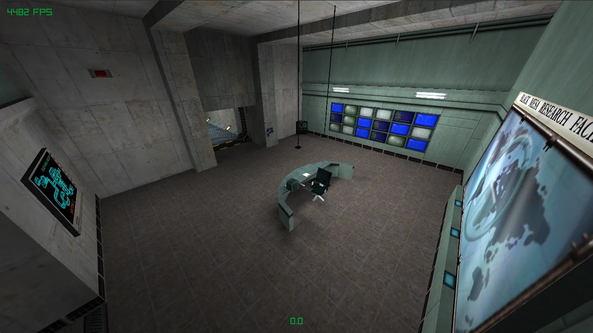

# Crank

Game engine built around Quake II BSP maps, written in C and
powered by [Raylib](https://www.raylib.com/).



## Features

- Quake II BSP (version 38) loader with entity, visibility, and brush parsing
- World mesh built once at load time and uploaded to the GPU
- Static lightmap atlas with shelf packing and 1-luxel padding
- Diffuse * lightmap shading via a custom GLSL shader
- Six-face skybox rendering
- Minimal ECS runtime for entity/component management
- JSON entity archetypes: BSP entities are matched to JSON definitions
  and spawned into the world automatically
- GoldSrc-style first-person physics (walk, air-move, step-slide, jump,
  noclip fly mode)
- Fixed-rate physics (128 Hz) with render-time interpolation
- PVS + frustum culling with dynamic per-surface index buffers

## Asset directories

These are NOT committed to the repository. Create them in the working
directory before running the engine:

- **`maps/`** — Quake II `.bsp` files. The map name passed on the command
  line is resolved as `maps/<name>.bsp`.
- **`textures/`** — Diffuse textures as `.png` files. The directory
  structure must mirror the texture names referenced in the BSP's texinfo
  lump. For example, if a face references `e1u1/floor1_2`, place the image
  at `textures/e1u1/floor1_2.png`.
- **`env/`** — Skybox textures as `.png` files, one per face,
  named `<skyname><suffix>.png` where suffix is one of `ft`, `bk`, `lf`,
  `rt`, `up`, `dn`. The sky name is read from the `worldspawn` entity's
  `sky` key, defaulting to `unit1_`.
- **`entities/`** — JSON entity archetype files. Each file is named
  `<classname>.json` and defines the components that make up that entity
  type. When a map is loaded, every entity in the BSP entity lump is
  matched to a JSON file by its `classname` and spawned into the ECS world.

The `shaders/` directory IS in the repository and is copied next to the
executable automatically by the CMake build.

## Building

Requirements:

- CMake 3.21 or newer
- A C11-capable C compiler (GCC or Clang)
- An OpenGL 3.3 capable GPU and drivers
- Build dependencies needed by Raylib's bundled GLFW
  (X11 headers on Linux: `libx11-dev`, `libxrandr-dev`, `libxinerama-dev`,
  `libxcursor-dev`, `libxi-dev`)

Raylib itself is fetched and built automatically by CMake.

```sh
cmake -S . -B build
cmake --build build
```

The output binary is `build/crank`.

## Running

From the project root (so the executable can see the asset directories
either by symlink or by being placed alongside them):

```sh
mkdir -p maps textures env entities    # if you haven't already
# ... drop your assets in ...
./build/crank c1a0
```

If no map name is given, the engine tries `c1a0`. Working directory must
contain `maps/`, `textures/`, `env/`, `entities/`, and `shaders/`.
